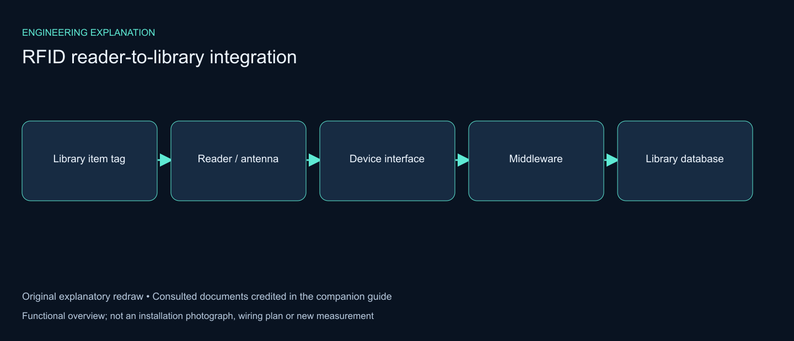

# RFID Library Automation System (ISO 15693)

## Illustrated engineering guide

[Read the full engineering guide](docs/engineering-guide.md) for architecture, workflow, design rationale, evidence notes and the source gallery.

*Explanatory diagram added for this write-up.*

Implemented a radio-frequency identification (RFID) system for library automation. Each item carries a tag, readers identify items over RF without line of sight, and a host database records every transaction. This replaces manual handling and barcode scanning for check-in/out, security and inventory.

## Role

Design, implementation and technical presentation of the system.

## At a glance

| Aspect | Choice in this system |
|---|---|
| Air interface | ISO/IEC 15693 (vicinity cards), 13.56 MHz HF |
| Coupling | Inductive, near field; passive tags powered by the reader |
| Tags | Passive HF labels, one per item, with a factory-locked 64-bit UID |
| Library data on the tag | Item ID plus security state (AFI and/or EAS bit) |
| Reader ↔ host link | RS-232, STX/ETX-framed commands |
| Host ↔ library system | SIP and/or vendor API |
| Stations | Staff counter, self-service kiosk, book-drop, security gates, handheld inventory reader, personalizer |

## How RFID works

1. The **reader** sends RF energy through its antenna.
2. The **tag** in that field powers up through RF coupling.
3. The tag returns its stored data.
4. The reader forwards the tag data to the **RFID host PC**.
5. The host PC logs the data in the **database**. It can also write updated data back to the tag.

A personalizer (application device) registers and programs the tags for the items.

### The 13.56 MHz link in detail

At 13.56 MHz the reader and the tag are coupled like the two windings of a loosely coupled transformer. The reader coil sets up an alternating magnetic field. The tag coil picks it up, a rectifier on the chip turns it into the chip's supply, and the carrier also gives the chip its clock. That is why a passive tag needs no battery.

Data moves differently in each direction:

- **Reader → tag (downlink):** the reader keys the carrier amplitude (ASK, 10 % or 100 % depth) and encodes bits by pulse position: 1-of-4 coding at 26.48 kbit/s or 1-of-256 at 1.65 kbit/s.
- **Tag → reader (uplink):** the tag cannot transmit on its own. It switches a load across its coil, and the reader sees this as a small change in its own antenna. The change is placed on a 423.75 kHz subcarrier (the carrier divided by 32), Manchester coded, at 26.48 kbit/s in high-rate mode.

## System architecture

The system has four layers. Tagged items sit at the top. Field devices talk to the tags over RF and to the host over serial links. The host middleware turns raw tag data into library transactions. The library management system (LMS) and database stay the source of truth for items, patrons and loans.

| Component | Function |
|---|---|
| Reader + antenna | Energizes tags, reads and writes tag data |
| Tags | Attached to each item; hold the item's identity and security state |
| Host PC + middleware | Drives the readers, decodes tag data, runs check-out, check-in and inventory rules, logs events |
| Database | Stores items, tags, loans, transactions and gate events |
| Library management system | Owns circulation and the catalogue; reached through SIP or an API |
| Personalizer | Programs tags for new items |

Keeping the RF detail inside the middleware means the LMS only ever sees item IDs and circulation messages. Readers can be replaced, or the tag format changed, without touching the library system.

## Tag structure

A tag is made of three parts:

- **Chip:** holds the information about the physical object.
- **Antenna:** transmits the radio signal.
- **Package:** encases the chip and antenna so the tag can be attached to the object.

### What is stored on the chip

An ISO 15693 chip has a fixed identifier, a few system bytes and a small block-organized user memory. The figure uses a common library chip class (64-bit UID, 28 blocks of 4 bytes) as the example.

- **UID (64 bits):** written and locked at the factory. It starts with E0h, then the chip maker's code, then a 48-bit serial number. Anticollision uses it to tell tags apart.
- **AFI (Application Family Identifier):** one byte that readers can filter on. Libraries use it to hold the security state.
- **DSFID (Data Storage Format Identifier):** tells a reader how the user memory is laid out.
- **User memory:** holds the item data written by the personalizer, at minimum the item ID. ISO 28560 defines the library data model for these blocks.
- **Lock bits:** after tagging, the item-ID blocks are locked so the tag cannot be rewritten.

## Tag types

The deck lists five tag categories: active, passive, semi-passive, extended-capability and other. Active and passive tags compare as follows:

| | Active tags | Passive tags |
|---|---|---|
| Power source | Battery | Energy from the reader |
| Power availability | Always on | Only while being read |
| Frequency | 455 MHz, 2.45 GHz, 5.8 GHz | Low frequencies up to UHF |
| Read range | Up to 100 m | 2–5 m |
| Memory | Up to 128 KB | Up to 256 bytes |
| Readiness | Always ready; responds when the reader's signal arrives | Works only when read; relatively slower response |
| Periodic maintenance | Required | Not required |
| Typical use | Large shipping containers | Files and small items |
| Cost | USD 10–100 | About USD 1 |

**Note on read range.** The 2–5 m figure in the deck is typical of passive UHF tags. The passive HF tags used here (ISO 15693, 13.56 MHz) work over a shorter range: a few centimetres to tens of centimetres on a counter pad, and up to about a metre across a gate aisle, depending on antenna size and reader power. That shorter range is a feature at the counter, because the reader only sees the books placed on the pad.

Passive tags suit library items because they are cheap, need no battery or maintenance, and their read range fits counters and gates.

### Why HF (13.56 MHz) rather than UHF for this library

| Factor | HF, ISO 15693 | UHF, ISO 18000-63 |
|---|---|---|
| Coupling | Inductive, near field | Radiative, far field |
| Typical range | Centimetres to about 1 m | Several metres |
| Near water, people, stacked thin items | Little detuning | More sensitive to detuning and shadowing |
| Read zone control | Tight: only items on the pad | Wider: stray reads need shielding or tuning |
| Library data standard | ISO 28560, widely deployed | Supported, but a later arrival in libraries |

For check-out on a pad and stacks of books packed together, the tight, predictable read zone of HF was the better fit.

## Reading a stack of books at once

When a patron puts several books on the pad, all their tags answer the same reader. ISO 15693-3 handles this with slotted anticollision. The reader sends an Inventory command with 16 time slots, and each tag replies in the slot given by 4 bits of its UID. Tags alone in a slot are read cleanly. If two tags share a slot, the reader repeats the Inventory with a mask so only those tags answer, now sorted by the next 4 UID bits, until every tag is identified.

## Library reader specification

| Parameter | Value |
|---|---|
| Standard | ISO 15693 |
| Frequency | 13.56 MHz |
| Dimensions | 400 × 200 × 120 mm |
| Housing | Metal |
| Data interface | RS-232 |
| Protocol | SIP and/or API (STX/ETX communication protocol in use) |
| Indicators | Tag-data LED and power LED |
| Supply voltage | 230 V |
| Certification | CE and radio approval |

### Host ↔ reader framing

Commands and replies travel over RS-232 as framed messages. A start byte (STX) and an end byte (ETX) mark the frame, a checksum protects the content, and the host retries when a reply is missing or corrupt. The figure shows the typical pattern; the exact field layout and byte values come from the reader vendor's manual.

## Workflows

### Self-service check-out

The patron identifies at the kiosk, then places the whole stack on the pad. The reader inventories every tag in one pass, the middleware sends one SIP checkout per item, and only after the library system confirms a loan is that item's tag switched to "checked out". An item whose checkout or tag write fails stays secured, so it cannot leave unnoticed.

### Return at the book-drop

The tag is read as the item drops. The middleware closes the loan through a SIP check-in, sets the tag back to "secured", and routes the item to the shelf, the hold shelf or a transit bin. Unreadable tags or failed writes go to an exception bin for a manual check.

### Security gates

The gates read the security state directly from the tag, so the alarm decision does not depend on the server being reachable. A secured item triggers the alarm and an event is logged with the UID, item, gate and time.

### Item life cycle

Each station moves the item, and its tag, from one state to the next: personalized, on shelf, on loan, missing, re-tagged or withdrawn.

## Data model

The host keeps the tables that link a tag to an item, an item to its loans, and every read to the station that made it. Only the item ID and the security state are written to the tag; everything personal stays on the server.

## Library applications

The system serves these library stations:

- staff circulation counter;
- self check-in/out kiosk;
- handheld inventory reader at the shelves;
- book-drop;
- security gates at the exit;
- tagged items.

The layout below places each station along the patron's path: in through the gates, to the stacks, to a kiosk, and out again.

## Benefits

- **Materials control:** fast inventorying, searching and notifying.
- **Circulation:** faster check-out and check-in.
- **Tags:** long-lasting.
- **Security:** theft prevention.
- **Staff:** reduced workload.
- **Reporting:** usage statistics are easy to gather.

## Engineering decisions

| Decision | Reason |
|---|---|
| HF ISO 15693 tags | Tight read zone at the pad, reliable with stacked books, established library data model (ISO 28560) |
| Security state stored on the tag (AFI / EAS) | Gates decide locally and keep working if the network or LMS is down |
| Middleware between readers and LMS | LMS sees only item IDs and SIP messages; readers can change without touching it |
| Write, then read back, on every state change | A failed write is caught before the item leaves or is shelved |
| Item-ID blocks locked after tagging | A tag cannot be rewritten to pose as another item |
| No patron data on the tag | A tag read alone reveals nothing about who borrowed the item |

## Limitations and mitigations

| Limitation | Mitigation |
|---|---|
| Metal (foil, metal-lined bags, metal shelves) shields or detunes HF tags | Gate tests with foil and bags; place tags away from metal covers |
| Tags lying flat on top of each other can fall out of the field or detune | Stagger tag positions inside books; test the pad with full stacks |
| Tag orientation relative to the gate antenna affects detection | Gate antennas on both sides of each aisle; test several orientations |
| Discs and media with metal layers | Use special media tags or booster rings |
| UID can be read by anyone with a reader | Keep personal data off the tag; links exist only in the loan record |
| RS-232 limits cable length and speed | Keep serial runs short; newer readers offer USB or Ethernet |

## Commissioning tests

- **Pad read test:** a stack of tagged books is read completely in one pass; repeat with the maximum stack size used at the kiosk.
- **Write and read-back test:** the security state changes on check-out and check-in, and the read-back confirms it.
- **Gate detection test:** secured items carried through each aisle at walking speed, in several orientations, trigger the alarm.
- **False-alarm test:** checked-out items and untagged personal items pass without an alarm.
- **Shielding test:** items in foil or metal-lined bags, to know where the gates' limits are.
- **Fallback test:** the gates still alarm with the host network disconnected.
- **Book-drop test:** returned items are checked in and sorted, and unreadable items land in the exception bin.

## Standards referenced

- **ISO/IEC 15693:** vicinity cards at 13.56 MHz (air interface, anticollision and commands).
- **ISO 28560:** data model for RFID in libraries (what goes into the user memory, AFI use).
- **SIP / SIP2:** Standard Interchange Protocol between self-service devices and the library system.
- **ISO/IEC 18000-63:** UHF air interface, used here only for comparison.

## Background

RFID traces back to 1945, when Léon Theremin built a covert listening device. It was passive: it was energized and activated by incoming radio waves and modulated the waves it reflected. That principle is still used by passive tags today.

## Technologies

RFID, ISO/IEC 15693, ISO 28560, 13.56 MHz HF, inductive coupling, slotted anticollision, AFI / EAS security, RS-232, STX/ETX framing, SIP2, passive tags, library automation

## Credits

- **Academic supervisor:** Dr. Abdulsalam Alkholidi. Faculty of Engineering, Sana'a University.
- **Images:** figures 01–04 are slides from the project presentation. Figures 05–16 are technical diagrams drawn for this write-up.

## Links

- [Portfolio project](https://mahyoub88.github.io/projects/proj-rfid-study/)
- [Author on LinkedIn](https://www.linkedin.com/in/mohammed-mahyoub)
- [ORCID](https://orcid.org/0009-0003-5640-352X)

## Illustrated project pages

Project-specific diagrams, source media and implementation context:

- [RFID Library Automation System (ISO 15693)](https://mahyoub88.github.io/projects/proj-rfid-study/)

[Browse all engineering case studies](https://mahyoub88.github.io/projects/)

## Additional technical explanation

[Read the illustrated system-boundary guide](docs/reference-guide/README.md) for component responsibilities, integration checks and credited reference context.

*New explanatory diagram; source attribution and interpretation are provided in the companion guide.*
