# RFID Library Automation System (ISO 15693) — Engineering Guide

Implemented a radio-frequency identification (RFID) system for library automation: tagged items are identified over RF by readers at the counter, self-service kiosk, shelves and exit gates, with every transaction recorded in a host database.

## Visual overview

*New explanatory diagram; grouped responsibilities, not an as-built schematic or test result.*

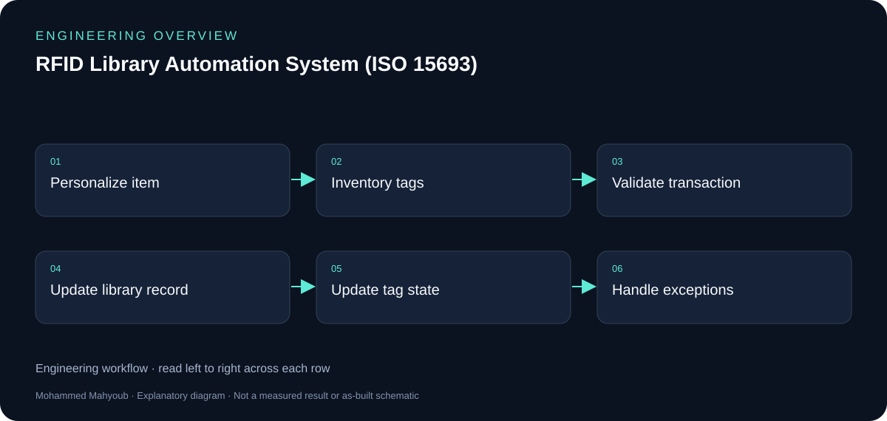

*New explanatory workflow; a documentation aid, not evidence that every proposed check was performed.*

## From RF identity to circulation

A passive tag is energized by the reader field and returns item data. The reader-to-host interface transports that data to the application, where it becomes a library transaction. The host/database remains the record of circulation.

## Different protocol boundaries

ISO 15693 describes the HF reader/tag interface. RS-232 and STX/ETX framing describe the reader/host connection. SIP/SIP2 describes interchange with the library application; it is distinct from telecom SIP in the IMS project.

## Original slides and new diagrams

The repository contains original presentation figures and a richer set of technical diagrams. Vendor-dependent examples such as memory layout, tag security conventions and gate fallback should be read as explanatory design patterns unless verified against the deployed hardware. The new overview is similarly labelled.

## Evidence to review or collect

The following are suggested review checks. A checklist entry is not a claimed pass result.

- Tag identity and item mapping.
- Check-in/out and security-state confirmation.
- Gate/inventory exception cases.
- Vendor interface and tag-model verification.

## Source gallery

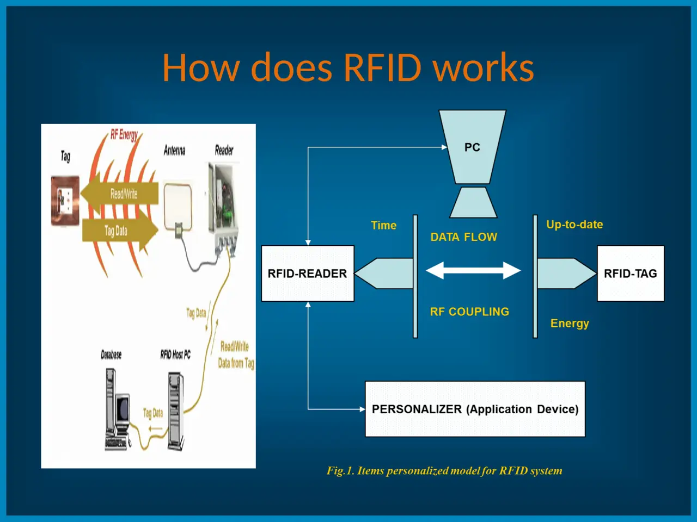

*how rfid works.*

*tag structure.*

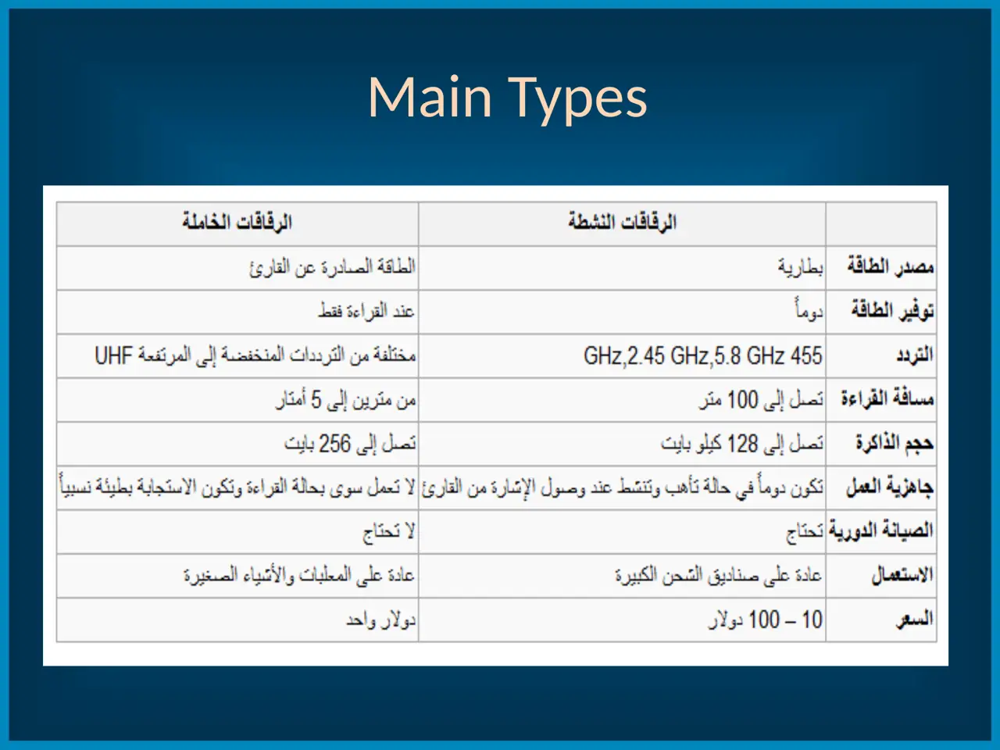

*active vs passive tags.*

*library utilizations.*

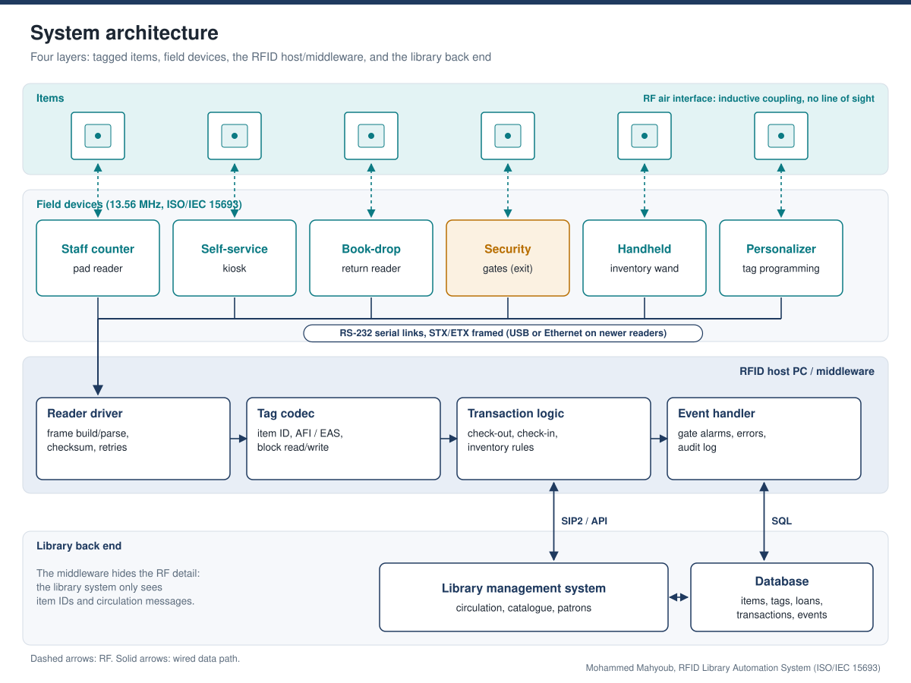

*system architecture.*

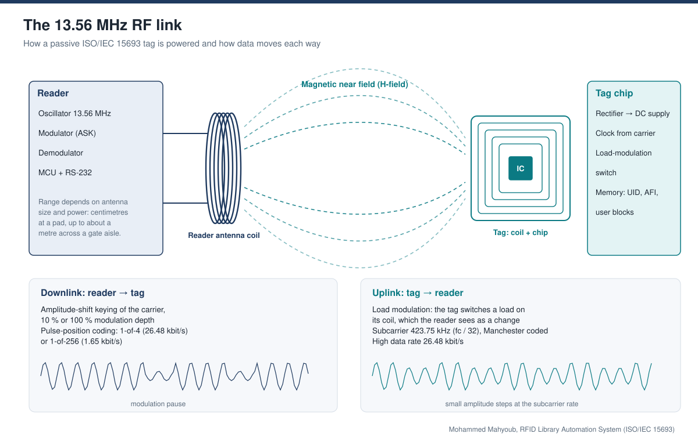

*rf link 13 56mhz.*

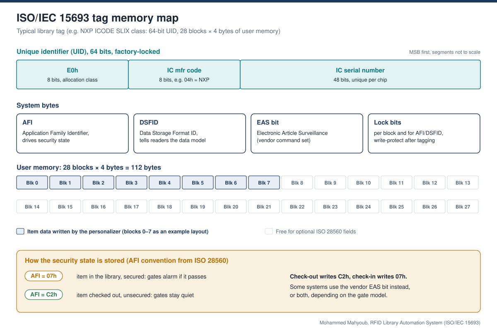

*tag memory map.*

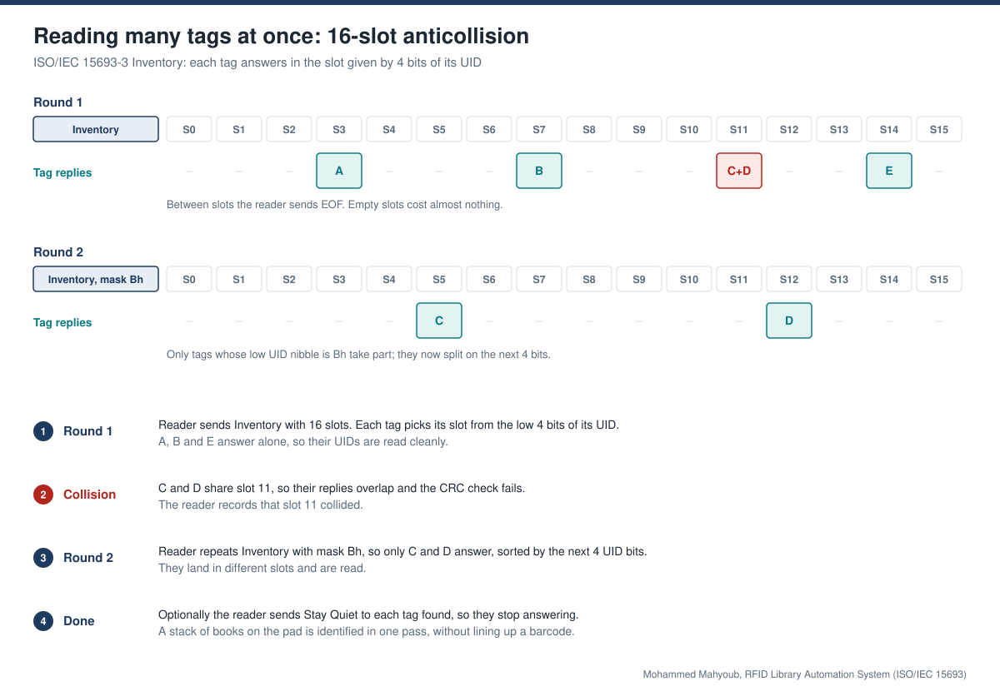

*anticollision inventory.*

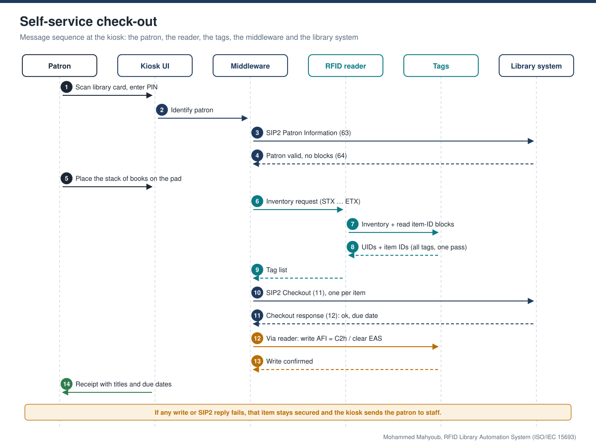

*checkout sequence.*

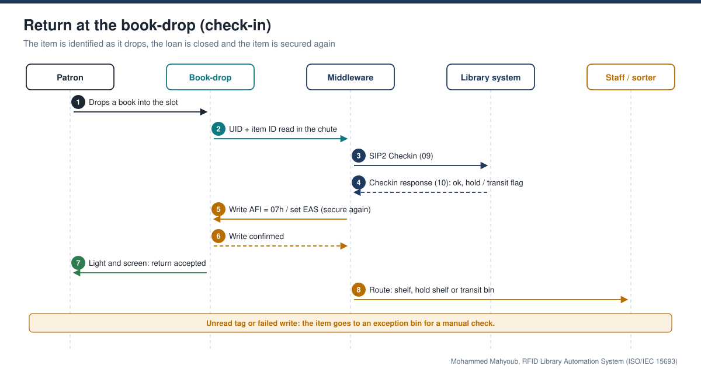

*checkin bookdrop sequence.*

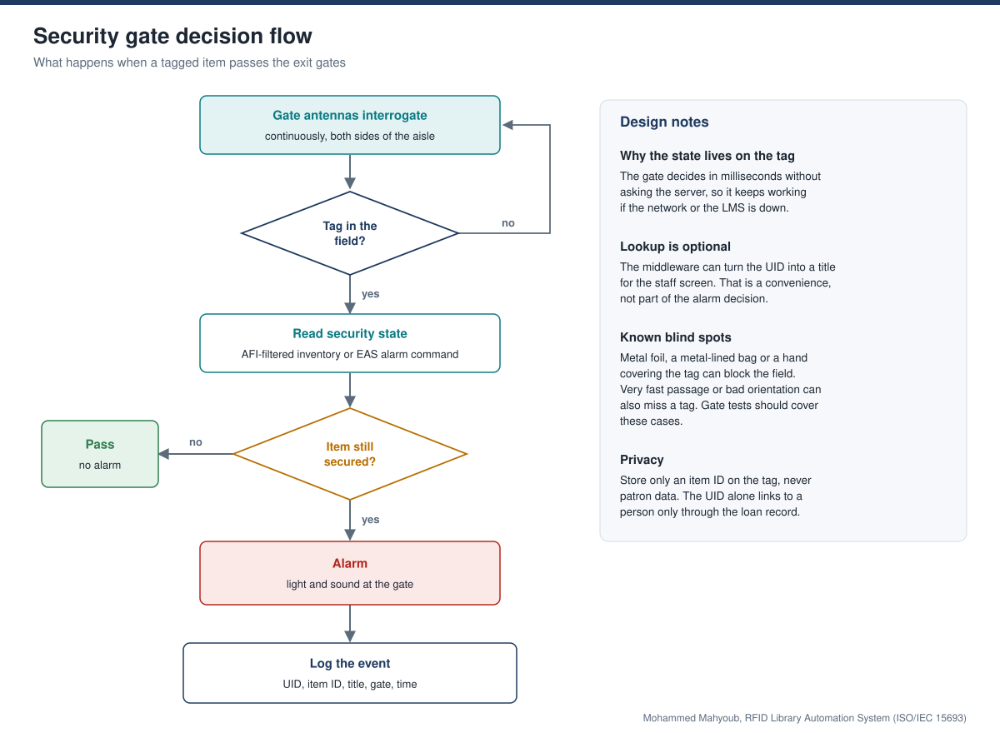

*security gate flow.*

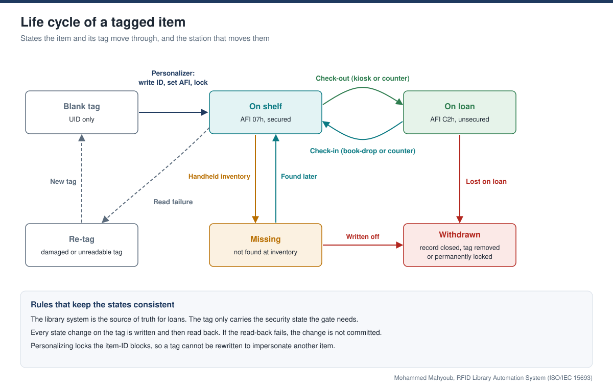

*item lifecycle.*

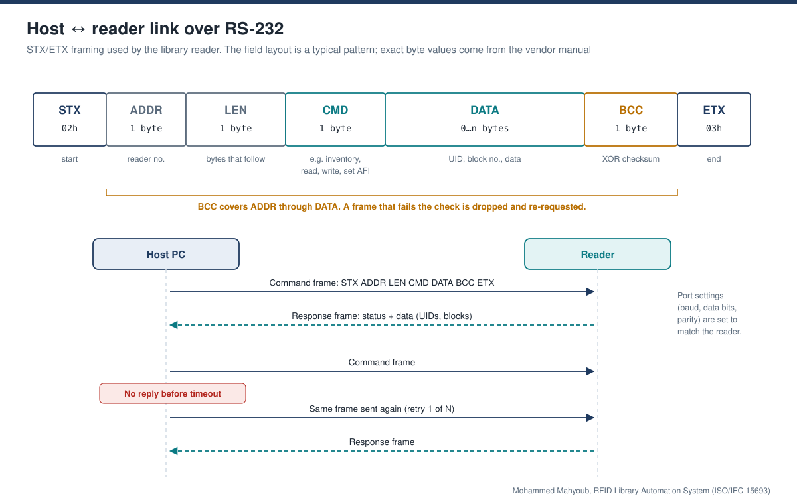

*rs232 stx etx frame.*

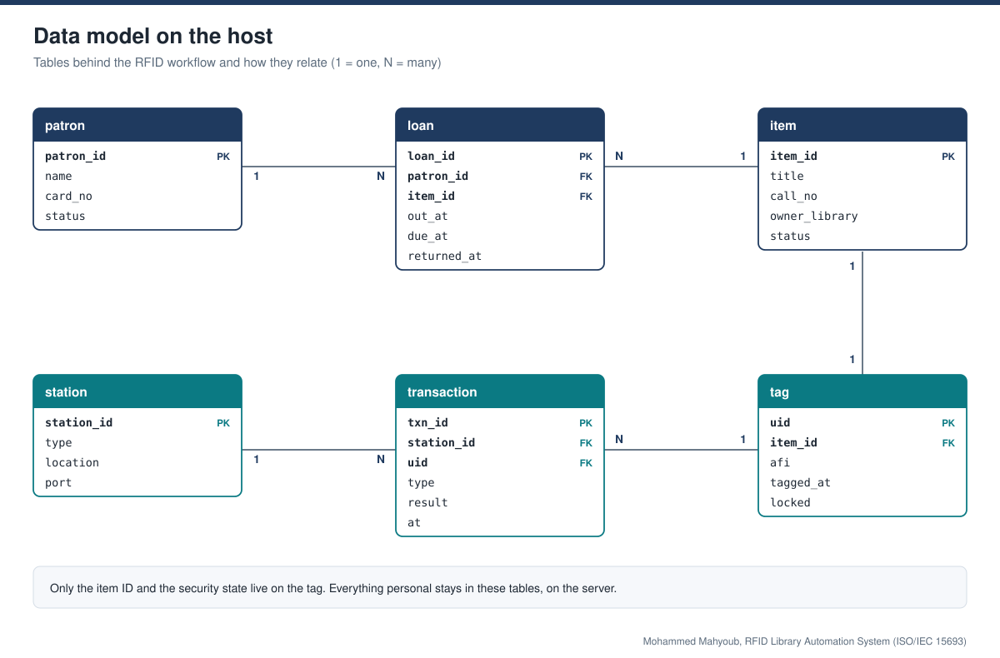

*host data model.*

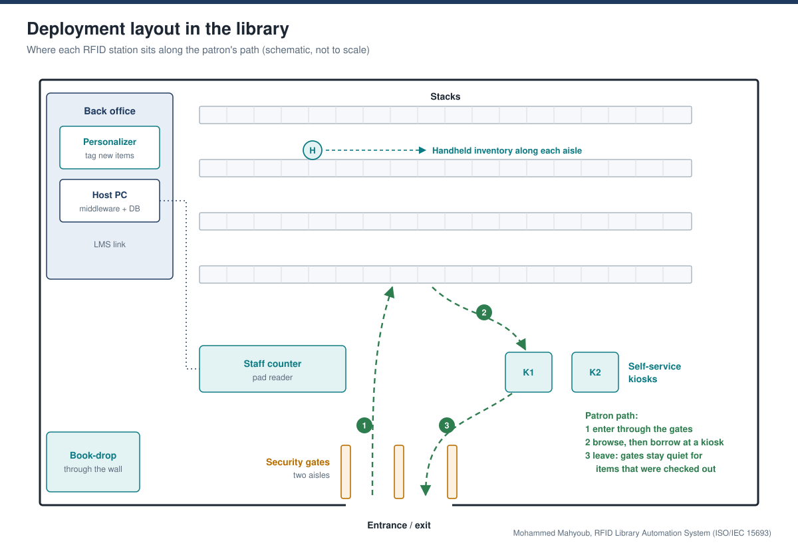

*deployment layout.*

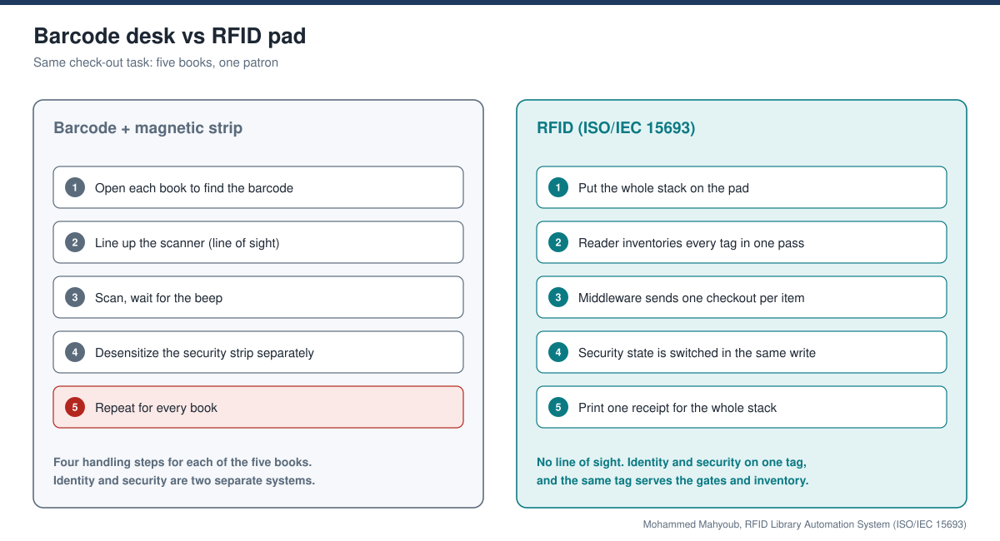

*barcode vs rfid.*

## Sources and provenance

- [Published portfolio description](https://mahyoub88.github.io/projects/proj-rfid-study/).
- [Project README](../README.md) and existing repository files.
- [LinkedIn projects](https://www.linkedin.com/in/mohammed-mahyoub/details/projects/): supplementary descriptions and project media.
- New SVG figures and explanatory text were authored for this documentation update; they are not original photographs or new measured results.
